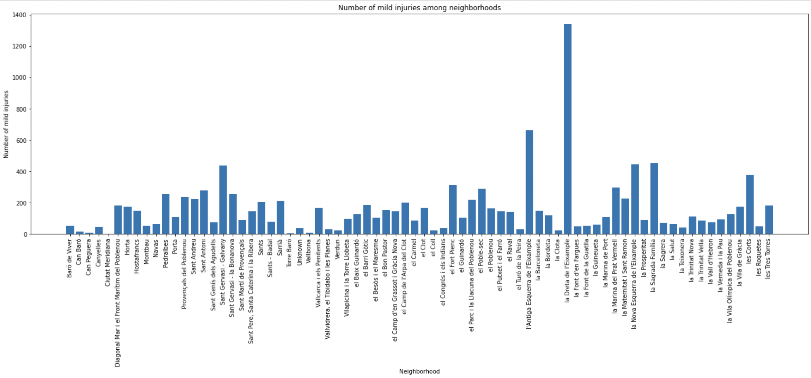
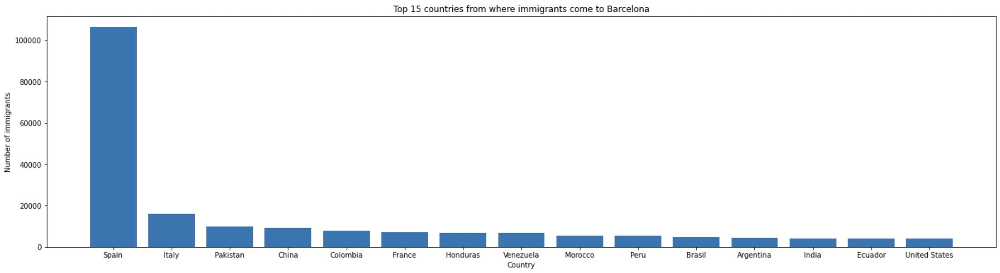

# Milestone 1 - Introducing the problem

## 1. Problematic

### 1.1 Overview
Being ranked very high on the list of best places to live in Europe, Barcelona represents an attractive location for people all around the world when it comes to residential choices, holidays, personal and business meet-ups, conferences, etc. Having beautiful architecture, wonderful food, excellent public transportation, and amazing weather, it hosts around seven million visitors annually and organizes more than 1000 events. With all daily news, that is presented outside Spain, normally going in this direction, most people started associating Barcelona only with previously mentioned points, which has consequently ensured its steady development and growth over the last 20 years. However, little could be read about the big immigration it has, as well as about the number of accidents and deaths happening. Moreover, an insignificantly small number of studies has been conducted so far, trying to find correlations between different events thet happened and the city organization itself (e.g. the number of accidents in different neighborhoods to increase the safety of the population), in order to improve its structure and make changes.

### 1.2 Motivation and Target audience

Nowadays, living in the fast-paced world, when people are getting more and more flexible about living abroad and feel more adaptable to changing environments, information about if the city meets their needs in terms of, for example, transportation and safety of the surrounding could be found useful. Being based on reliable data source, visualizations that are going to be made in this project could be later used by people all around the world who are considering moving to Barcelona. It will cover the basic information in order to meet the needs of the majority.

### 1.3 Our goals

Considering the fact that visualizations are more appealing to the human eye when being compared with pure statistical data, we believe that representing data through interactive graphs could lead also to a greater understanding of the issue we try to tackle. By providing users with the chance to interactively gain information about life in Barcelona, we think that they could imagine themselves better in its environment and therefore make the optimal decision about migrating.

The visualization we will provide will deal with the following questions:

- What is the safest neighborhood in Barcelona? Describing the safety of Barcelona neighborhoods. : In this question, we would like to address and analyze the problem of accidents happening in Barcelona, in order to see if the safest neighborhood could be determined. The answer to this question would help many people that are moving to Barcelona make a decision on where to search for an apartment, especially if they have kids. On the other hand, the information results could be used by the authorities to provoke further analysis on why are certain neighborhoods unsafe, and if they can do something in order to tackle this issue and create a safe environment for living in all Barcelona neighborhoods. 

- What is the overall popularity of living in Barcelona? :  Here we would analyze all the data provided in the Barcelona data sets and make visualizations that could be later used and assessed by people who are trying to see if Barcelona is the right place for them. It is clear that the number of day and night bus stops in a very big city, number of accidents, the birth-death ratio, etc. are very important factors when determining your next home. Also, the immigrant-emigrant statistics will help in determining how crowded can Barcelona get.

## 2. Dataset

The dataset which is going to be used in this analysis is Kaggle-one Barcelona [data set](https://www.kaggle.com/datasets/xvivancos/barcelona-data-sets). Acknowledged by Barcelona City Council and Barcelona Digital City, Barcelona data sets consist of different files containing information about various aspects of the city, offering a possibility to tackle many issues. The ones that are going to be used in this study are:

- [deaths.csv](data/deaths.csv)
- [population.csv](data/population.csv)
- [immigrants_by_nationality.csv](data/immigrants_by_nationality.csv)
- [immigrants_emigrants_by_age.csv](data/immigrants_emigrants_by_age.csv)
- [immigrants_emigrants_by_destination.csv](data/immigrants_emigrants_by_destination.csv)
- [immigrants_emigrants_by_destination2.csv](data/immigrants_emigrants_by_destination2.csv)
- [immigrants_emigrants_by_sex.csv ](data/immigrants_emigrants_by_sex.csv)
- [accidents_2017.csv](data/accidents_2017.csv)

These files contain the data about the population in different Barcelona neighborhoods, accidents, and immigration statistics.
It should be mentioned that this dataset is cleaned. There is no poor-quality data and even there is an **integrity** of the same data through different files.

## 3. Exploratory data analysis

In this section, we are providing some basic statistics of our dataset alongside a few insightful graphs.

For conducting the first analysis, we used the [pandas](https://pandas.pydata.org/) library [Python 3.9](https://www.python.org/downloads/release/python-390/), and the work can be found in [this notebook](exploration/datavizEDA.ipynb). Some of the main conclusions we made are:

- There is information about 74 neighborhoods in Barcelona in our dataset.
- Most popular names in Barcelona are Maria (38346 records), Antonio (33091 records), and Montserrat (32480 records).
- Andalusia is the part of Spain from where most people migrate to Barcelona.
- More than 100000 people from Spain migrated to Barcelona from other cities.
- Of 3162 bus stops in Barcelona, 2324 are day bus stops, and 838 of them are night bust stops.

To back up our findings, we are providing the following plots.

  
  Number of immigrants by neighborhood

  
  Top 15 countries by number of immigrants to Barcelona

  
  Number of immigrants from other parts of Spain that migrated to Barcelona

## 4. Related work

**Data exploration made by others**

As it was said previously, the dataset we are going to use is taken from Kaggle. That is why there were a few attempts to work with this data. Most of them have not had a lot of visualization (just several base plots written in Python to analyze some exact problem). Also, there was one very good exploration of the dataset with a lot of images written in R language. But this exploration is mostly like an overview and does not provide answers to some exact questions.

We are now providing the sources:

- [Discovering Barcelona Part 1](https://www.kaggle.com/code/xvivancos/discovering-barcelona-part-i) - A project intended to demonstrate and visualize all the main points from the dataset. It includes a lot of standard plots combined with a number og interactive maps and a [Sankey diagram](https://en.wikipedia.org/wiki/Sankey_diagram).

- [Discovering Barcelona Part 2](https://www.kaggle.com/code/xvivancos/discovering-barcelona-part-ii) - The follower of the project mentioned above. It is focused more on the interactive maps to help the users better understand the data.

- [Barcelona City - A Comprehensive Study](https://www.kaggle.com/code/gaurav06/barcelona-city-a-comprehensive-study) - This projects includes visulizations in form of bar plots, interactive maps, and a heat map of accidents' locations.

**Originality of our approach**

Even though the mentioned visualization projects from above are very thorough, we will try to create a smaller number of insightful interactive demonstrations that will appeal to the users as a very convenient way of getting answers to the questions they have.

**Sources of inspiration**

For the sources of inspiration we are focusing mostly on our creativity to recognize the needs of people that are thinking of moving to Barcelona.

Furthermore, we will try to incorporate ideas from some of the interesting visualization projects including interactive maps. Some of the examples could be found on [this link](https://www.tableau.com/learn/articles/interactive-map-and-data-visualization-examples).
